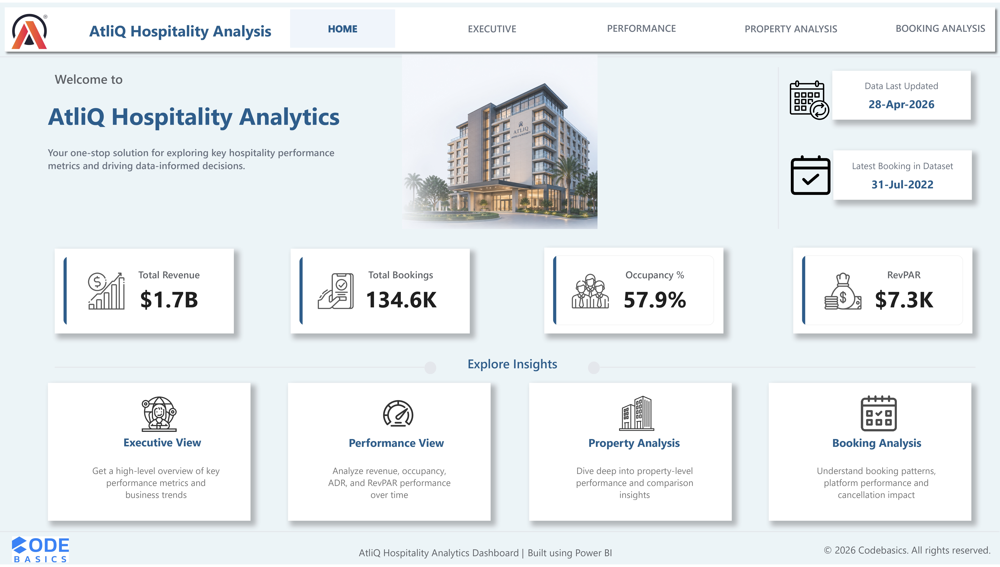

# 🏨 AtliQ Hospitality Analytics Dashboard

An end-to-end Power BI project analyzing hospitality performance across revenue, occupancy, pricing, and booking channels to drive data-driven business decisions.

---

## 🎯 Project Overview

This dashboard provides a **360° view of hospitality performance**, enabling stakeholders to:

- Track revenue, occupancy, ADR, and RevPAR trends
- Identify high & low performing properties
- Analyze pricing vs demand dynamics
- Evaluate booking platform effectiveness
- Understand cancellation impact on revenue

The goal is to support **strategic decision-making across operations, pricing, and channel optimization.**

---

## 🧠 Key Insights

- 📉 Revenue declined despite stable occupancy → Indicates **pricing pressure**
- 💰 High occupancy but lower ADR in some properties → **Pricing optimization opportunity**
- ⚠️ Consistent cancellation rates across platforms → **Booking reliability risk**
- 🏨 Premium properties drive higher RevPAR but show higher cancellation exposure
- 🌍 Mumbai contributes highest revenue, while Delhi leads in occupancy

---

## 🖼️ Dashboard Preview

### 🏠 Home

---

### 📊 Executive View

---

### 📈 Performance View

---

### 🏢 Property Analysis

---

### 📅 Booking Analysis

---

## 🧩 Features

- Interactive filters (City, Property, Room Class, Platform, Time)
- Dynamic KPI tracking with WoW comparison
- Pricing vs Demand analysis (scatter visualization)
- Top/Bottom property benchmarking
- Revenue vs Cancellation analysis
- Platform contribution & risk assessment
- Insight-driven storytelling visuals

---

## 🛠️ Tools & Technologies

- Power BI
- DAX (Data Analysis Expressions)
- Data Modeling
- Data Visualization
- Business Intelligence

---

## 📌 Key Metrics

- Revenue
- Total Bookings
- Occupancy %
- ADR (Average Daily Rate)
- RevPAR (Revenue per Available Room)
- Cancellation %
- Realisation %

---

## ⭐ Project Highlights

- Designed a **multi-page interactive dashboard**
- Built **dynamic DAX measures for KPI tracking**
- Applied **business-driven insights layer**
- Focused on **clean UI/UX & storytelling**

---

## 🔗 Live Dashboard

[View Interactive Dashboard](https://app.powerbi.com/view?r=eyJrIjoiNDU1ODdlZmEtM2Q4Mi00ZGVlLTg4NWYtYjcxNmI2YTYxOWJiIiwidCI6ImM2ZTU0OWIzLTVmNDUtNDAzMi1hYWU5LWQ0MjQ0ZGM1YjJjNCJ9)

## 👤 Author

**Aditya Shinde**

- 💼 Aspiring Supply Chain Analyst
- 📊 Skilled in Power BI, Excel, Data Analytics  

🔗 LinkedIn: https://www.linkedin.com/in/aditya-shinde7/
🔗 GitHub: https://github.com/shindeaditya007  

---

## 📌 Acknowledgment

This project is inspired by the Codebasics Power BI challenge and enhanced with custom design, insights, and business storytelling.

---

⭐ If you found this project useful, consider giving it a star!
