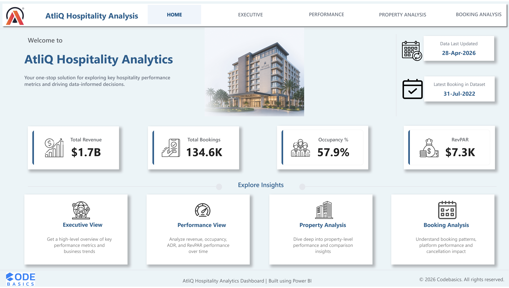
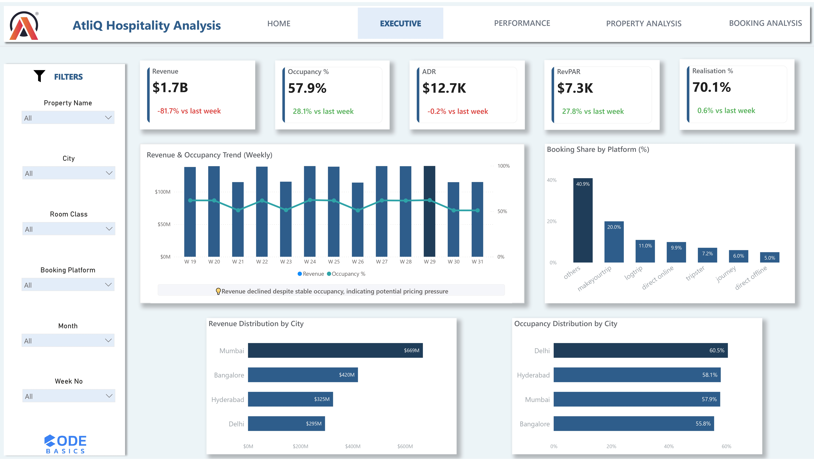
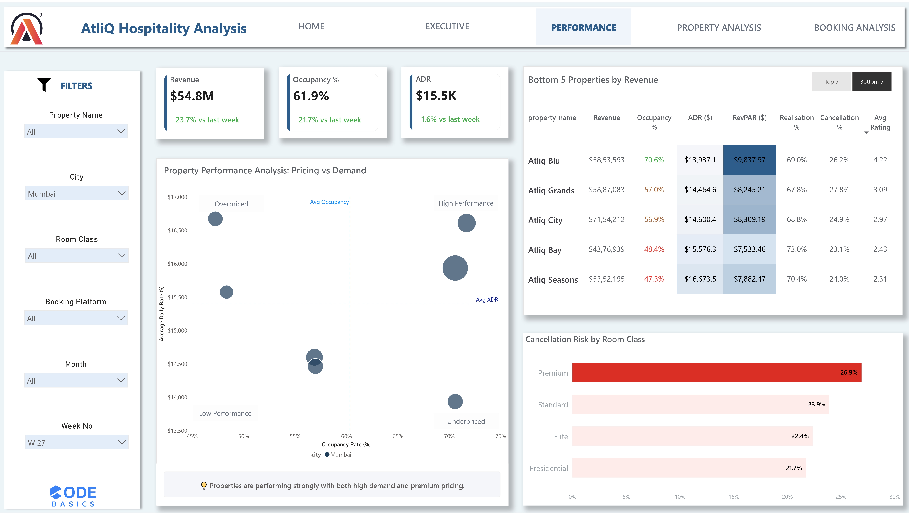
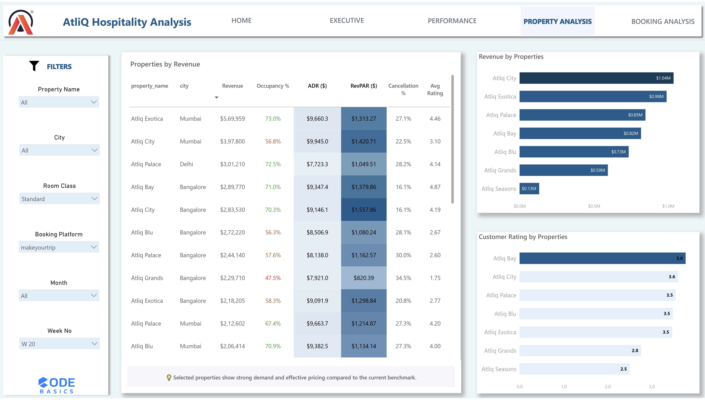
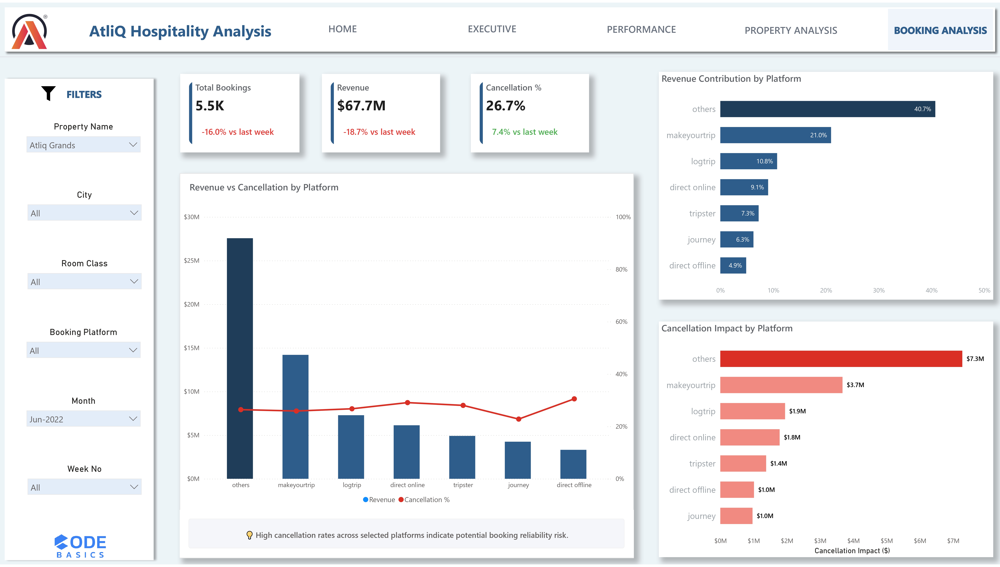

# 🏨 AtliQ Hospitality Analytics Dashboard

An end-to-end Power BI project designed to analyze hospitality performance across revenue, occupancy, pricing, and booking channels.

---

## 📊 Project Overview

This dashboard provides actionable insights into hotel performance by combining key business metrics such as:

- Revenue
- Occupancy %
- ADR (Average Daily Rate)
- RevPAR
- Booking trends
- Cancellation analysis

The goal is to support data-driven decision-making for pricing, operations, and channel optimization.

---

## 🧩 Dashboard Views

### 🔹 Home
- Central navigation hub
- KPI summary
- Interactive navigation cards

---

### 🔹 Executive View
- High-level KPI overview
- Weekly trend analysis
- Revenue vs occupancy insights

---

### 🔹 Performance View
- Pricing vs demand analysis (Scatter plot)
- Top/Bottom property performance
- Cancellation risk insights

---

### 🔹 Property Analysis
- Property-level revenue breakdown
- Conditional formatting for performance comparison
- Customer rating insights

---

### 🔹 Booking Analysis
- Platform-wise revenue contribution
- Cancellation impact analysis
- Channel performance insights

---

## 🛠️ Tools & Techniques

- Power BI
- DAX (Data Analysis Expressions)
- Data Modeling
- Conditional Formatting
- Dynamic Measures & Insights
- UI/UX Design for dashboards

---

## 💡 Key Highlights

- Built dynamic insight generation using DAX
- Implemented Top/Bottom analysis using ranking logic
- Designed interactive navigation for seamless user experience
- Applied consistent UI/UX principles across all views

---

## 🚀 Outcome

This project demonstrates the ability to:
- Translate business problems into analytical dashboards
- Generate actionable insights from data
- Design user-friendly and visually consistent BI solutions

---

## 📌 Author

Aditya Shinde
